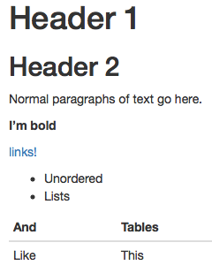

---

class: inverse, middle, center

# Tidy Data


---


1. Each variable forms a column.
2. Each observation forms a row.
3. Each type of observational unit forms a table.

The third point means we don't mix apples and oranges.

---

## What is Tidy Data?

1. Each observation forms a row. In other words, each row corresponds to a single instance of an <u>observational unit</u>
1. Each variable forms a column:
    + Some variables may be used to identify the <u>observational units</u>. 
    + For organizational purposes, it's generally better to put these in the left-hand columns
1. Each type of observational unit forms a table with the entries in the table corresponding to values.

---

## Differentiating between <u>neat</u> data and <u>tidy</u> data

- Colloquially, they mean the same thing
- But in our context, one is a subset of the other. 

<br>

<u>Neat</u> data is 
  - easy to look at, 
  - organized nicely, and 
  - in table form.

--

<u>Tidy</u> data is neat but also abides by a set of three rules.

---

class: center, middle

<a href="http://stream1.gifsoup.com/view8/20150404/5192859/lebowski-abides-o.gif"></a>


---

## Is this tidy?

```{r echo=FALSE, message=FALSE, warning=FALSE}
library(fivethirtyeight)
set.seed(2)
bechdel %>% sample_n(12) %>%
  select(year, title, clean_test, budget_2013) %>%
  arrange(title) %>%
  kable(format = "html")
```


---

name: demscore

## How about this? Is this tidy?

```{r echo=FALSE, message=FALSE, warning=FALSE}
dem_score <- read_csv("data/dem_score.csv")
knitr::kable(dem_score %>% slice(1:12), format = "html")
```

---

name: whytidy

## Why is tidy data important?

- Think about trying to plot democracy score across years in the simplest way possible.
--

- It would be much easier if the data looked like what follows instead so we could put 
    - `year` on the `x`-axis and 
    - `dem_score` on the `y`-axis.

---

## Tidy is good

```{r echo=FALSE}
dem_score_tidy <- dem_score %>% 
  gather(-country, key = "year", value = "dem_score") %>% 
  mutate(year = as.numeric(year)) 
set.seed(2)
dem_score_tidy %>% sample_n(13) %>% arrange(country) %>% 
  knitr::kable(format = "html")
```

---

## Let's plot it

- Plot the line graph for three countries using `ggplot`

```{r}
dem_score4 <- dem_score_tidy %>%
  filter(country %in% c("Pakistan", "Portugal", "Uruguay"))
ggplot(data = dem_score4, mapping = aes(x = year, y = dem_score)) +
  geom_line(mapping = aes(color = country))
```

---

# Regression Highlights

1. Experience with `ggplot2` package and knowledge of the Grammar of Graphics primes students for regression
1. Use of the `broom` package to unpack regression

---

## 1. `ggplot2` Primes Regression

* Mapping aesthetics to variables provides a natural framework for all of data visualization.  Understanding the relationships between variables is clear and transparent from the `ggplot2` code.
* This ultimately what regression is about!

---

## 1. `ggplot2` Primes Regression

Example:

* All Alaskan Airlines and Frontier flights leaving NYC in 2013
* We want to study the relationship between temperature and departure delay
* For summer (June, July, August) and non-summer months separately

Involves four variables: 

- `carrier`, `temp`, `dep_delay`, `summer`

---

## 1. `ggplot2` Primes Regression

```{r, echo=FALSE, fig.height=5, fig.width=10.5}
library(ggplot2)
library(dplyr)
library(nycflights13)

flights_subset <- flights %>% 
  filter(carrier == "AS" | carrier == "F9") %>% 
  left_join(weather, by=c("year", "month", "day", "hour", "origin")) %>% 
  filter(dep_delay < 250) %>% 
  mutate(summer = ifelse(month == 6 | month == 7 | month == 8, "Summer Flights", "Non-Summer Flights"))

ggplot(data = flights_subset, mapping = aes(x = temp, y=dep_delay, col=carrier)) + 
  geom_point() +
  geom_smooth(method = "lm", se = FALSE) +
  facet_wrap(~summer)
```

---

## 1. `ggplot2` Primes Regression

Why? Dig deeper into data. Look at `origin` and `dest` variables as well:

<br> 

```{r, echo=FALSE, fig.width=10.5, fig.height=5}
flights_subset %>% 
  group_by(carrier, origin, dest) %>% 
  summarise(`Number of Flights` = n()) %>% 
  kable(digits=3, format = "html")
```

---


## 2. `broom` Package

* The `broom` package takes the messy output of built-in modeling functions in R, such as
`lm`, `nls`, or `t.test`, and turns them into tidy data frames.
* Fits in with `tidyverse` ecosystem
* This works for [many R data types](https://github.com/tidyverse/broom#available-tidiers)!

---

## 2. `broom` Package

In our case, `broom` functions take `lm` objects as inputs and return the following in tidy format!

* `tidy()`: regression output table
* `augment()`: point-by-point values (fitted values, residuals, predicted values)
* `glance()`: scalar summaries like $R^2$, 

---

## 2. `broom` Package

The chapter will be built around this code:  (Available in the supplementary HTML document [here].)

```{r, eval=FALSE}
library(ggplot2)
library(dplyr)
library(nycflights13)
library(knitr)
library(broom)
set.seed(2017)

# Load Alaska data, deleting rows that have missing departure delay
# or arrival delay data
alaska_flights <- flights %>% 
  filter(carrier == "AS") %>% 
  filter(!is.na(dep_delay) & !is.na(arr_delay)) %>% 
  sample_n(50)
View(alaska_flights)


# Exploratory Data Analysis----------------------------------------------------
# Plot of sample of points:
ggplot(data = alaska_flights, mapping = aes(x = dep_delay, y = arr_delay)) + 
   geom_point()

# Correlation coefficient:
alaska_flights %>% 
  summarize(correl = cor(dep_delay, arr_delay))

# Add regression line
ggplot(data = alaska_flights, mapping = aes(x = dep_delay, y = arr_delay)) + 
  geom_point() +
  geom_smooth(method = "lm", se = FALSE, color = "red")


# Fit Regression and Study Output with broom Package---------------------------
# Fit regression
delay_fit <- lm(formula = arr_delay ~ dep_delay, data = alaska_flights)

# 1. broom::tidy() regression table with confidence intervals and no p-value stars
regression_table <- delay_fit %>% 
  tidy(conf.int=TRUE)
regression_table %>% 
  kable(digits=3)

# 2. broom::augment() for point-by-point values
regression_points <- delay_fit %>% 
  augment() %>% 
  select(arr_delay, dep_delay, .fitted, .resid) 
regression_points %>% 
  head() %>% 
  kable(digits=3)

# and for prediction
new_flights <- data_frame(dep_delay = c(25, 30, 15))
delay_fit %>% 
  augment(newdata = new_flights) %>% 
  kable()

# 3. broom::glance() scalar summaries of regression
regression_summaries <- delay_fit %>% 
  glance() 
regression_summaries %>% 
  kable(digits=3)


# Residual Analysis------------------------------------------------------------
ggplot(data = regression_points, mapping = aes(x = .resid)) +
  geom_histogram(binwidth=10) +
  geom_vline(xintercept = 0, color = "blue")
ggplot(data = regression_points, mapping = aes(x = .fitted, y = .resid)) +
  geom_point() +
  geom_abline(intercept = 0, slope = 0, color = "blue")
ggplot(data = regression_points, mapping = aes(sample = .resid)) +
  stat_qq()


# Preview of Multiple Regression-----------------------------------------------
flights_subset <- flights %>% 
  filter(carrier == "AS" | carrier == "F9") %>% 
  left_join(weather, by=c("year", "month", "day", "hour", "origin")) %>% 
  filter(dep_delay < 250) %>% 
  mutate(summer = ifelse(month == 6 | month == 7 | month == 8, "Summer Flights", "Non-Summer Flights"))

ggplot(data = flights_subset, mapping = aes(x = temp, y=dep_delay, col=carrier)) + 
  geom_point() +
  geom_smooth(method = "lm", se = FALSE) +
  facet_wrap(~summer)
```


---


## What is Markdown?

 - A "plaintext formatting syntax"
 - Type in plain text, render to more complex formats
 - One step beyond writing a `txt` file
 - Render to HTML, PDF, DOCX, etc. using Pandoc

---

## What does it look like?

.left-column[
```
  # Header 1
  
  ## Header 2
  
  Normal paragraphs of text go here.
  
  **I'm bold**
  
  [links!](http://rstudio.com)
  
   * Unordered
   * Lists   
   
  And  Tables
  ---- -------
  Like This
  
```
]

.right-column[

]

---

## What is R Markdown?
  
- "Literate programming"
- Embed R code in a Markdown document
- Renders textual output along with graphics

***

.left-column[
```

```{r chunk1}
library(ggplot2)
library(nycflights13)
pdx_flights <- flights %>% 
  filter(dest == "PDX", month == 5)
nrow(pdx_flights)
```

```{r chunk2}
ggplot(data = pdx_flights,
  mapping = aes(x = arr_delay, 
                y = dep_delay)) +
  geom_point()
```

```
]

.right-column[
```{r, fig.width=4.5, fig.height=4, echo=FALSE}
library(ggplot2)
library(nycflights13)
pdx_flights <- flights %>% 
  filter(dest == "PDX", month == 5)
nrow(pdx_flights)
ggplot(data = pdx_flights,
  mapping = aes(x = arr_delay, 
                y = dep_delay)) +
  geom_point()
```
]

---

# Acknowledgements